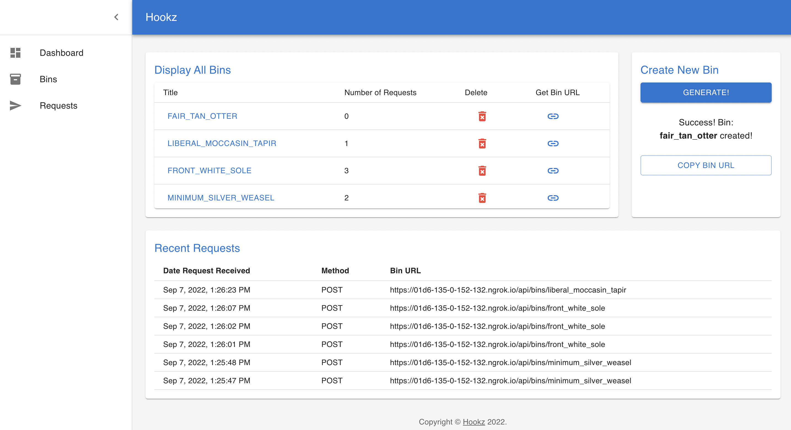

# Hookz - Debugging Webhooks

## Background
The purpose of building this application was to build a tool in order to test and debug webhooks. 

### What is a Webhook?
A webhook can be thought of as a type of API that is driven by events rather than requests. Instead of one application making a request to another to receive a response, a webhook is a service that allows one program to send data to another as soon as a particular event takes place. Webhooks are sometimes referred to as “reverse APIs,” because communication is initiated by the application sending the data rather than the one receiving it. With web services becoming increasingly interconnected, webhooks are seeing more action as a lightweight solution for enabling real-time notifications and data updates without the need to develop a full-scale API.

Say for instance you want to receive Slack notifications when tweets that mention a certain account and contain a specific hashtag are published. Instead of Slack continuously asking Twitter for new posts meeting these criteria, it makes much more sense for Twitter to send a notification to Slack only when this event takes place. This is the purpose of a webhook––instead of having to repeatedly request the data, the receiving application can sit back and get what it needs without having to send repeated requests to another system.

For more information, check out this article [here](https://www.mparticle.com/blog/apis-vs-webhooks/)

## Sample Display
Here is a sample of what the finished product looks like

### **Dashboard**

 
